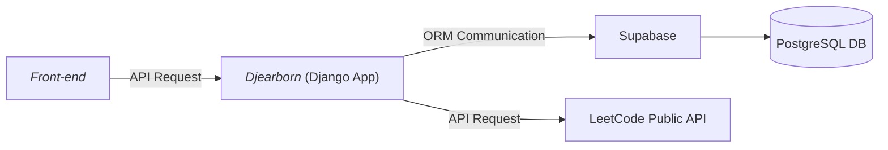

# 🐍 Djearborn - Dearborn Coding Club's Backend Django Server
> A neat lil' backend.


🐍 A Django backend API webserver for serving static assets and handling requests for dearborncodingclub.com. It is currently hooked up to https://api.dearborncodingclub.com/notes. Please ask to join our slack channel [here](https://dearborncodingclub.slack.com)! We'd also love to have you hang out in our meetup group [here](https://www.meetup.com/dearborn-coding-club).

## Table of Contents
1. [Architecture](#architecture)
    * [System Design](#system-design)
    * [Folder Structure](#folder-structure)
2. [Getting Started](#getting-started)
    * [Running with Virtual Env](#running-with-virtual-env-recommended)
    * [Running with Docker](#running-in-docker)
    * [Running Migrations](#running-migrations)
    * [Running linters](#running-linters)
3. [Deploying to Fly.io](#deploying-to-flyio)
4. [Regenerating Certs](#regenerating-tls-certificates)
5. [Running on a different domain](#running-the-application-on-a-different-domain)
6. [API Docs](./docs/APIs.md)

### Architecture
---

#### System Design


#### Folder Structure

```
website-base-backend/
|--- Dockerfile         # Docker configuration.
|--- Makefile           # Helper file to run scripts locally.
|--- manage.py          # Command-line tool for managing Django server.
|--- accounts/
    |--- migrations/    # Database migrations for user account data.
    |--- admin.py       # Admin page configuration.
    |--- apps.py        # Django app configuration (Accounts).
    |--- models.py      # ORM data models used for interfacing with database.
    |--- serializers.py # Database object serializers.
    |--- tests.py       # Application unit tests.
    |--- urls.py        # Submodule routing.
    |--- views.py       # Definition of views/responses for routes.
|--- core/              # Core Django application features including routes, migrations, and models.
    |--- migrations/    # Database migrations for scaffolding database.
    |--- admin.py       # Admin page configuration.
    |--- apps.py        # Django app configuration (Core).
    |--- models.py      # ORM data models used for interfacing with database.
    |--- serializers.py # Database object serializers.
    |--- tests.py       # Application unit tests.
    |--- urls.py        # Submodule routing configuration; pulled in to `public_api/urls.py`.
    |--- views.py       # HTTP Response views; contains API response code.
|--- public_api         # `api.dearborncodingclub` Django application.
    |--- asgi.py        # Scaffloded ASGI Python application.
    |--- settings.py    # Server configuration.
    |--- urls.py        # Primary routing configuration.
    |--- views.py       # HTTP Response views; primary.
    |--- wsgi.py        # Scaffloded WSGI Python application.
|--- server             # Database config.
```

### Getting Started
---
### Running with Virtual Env (recommended)
1. Make sure you install `python3` on your local machine and  have a virtual environment set up.
    - On Mac/Linux you can install Python3 using homebrew: [link 🔗](https://docs.brew.sh/Homebrew-and-Python).
    - On Windows, you can install it using the installer: [link 🔗](https://www.python.org/downloads/).
    - If you don't have the `python3` alias set, you can configure the from alias for `python3` to point to your `python` installation (on Mac).
        - `echo 'alias python="python3"' >> ~/.zshrc && source ~/.zshrc;`
2. Run a Python virtual environment:
    - `python -m venv ./` or `python3 -m venv ./` if you have `Python3`.
    - Activate local python environment
        - `source bin/activate` or `.\Scripts\activate` for windows.
    - Upgrade pip
        - `python -m pip install --upgrade pip` or `python3 -m pip install --upgrade pip` if you have `Python3`.
    - Install python dependencies
        - `python -m pip install -r requirements.txt` or `python3 -m pip install -r requirements.txt` if you have `Python3`.
    
    - If you don't have the `python3` alias set, you can configure the from alias for `python3` to point to your `python` installation.
        - `echo 'alias python="python3"' >> ~/.zshrc && source ~/.zshrc;`
2. Setting up postgrest database

One way to do it ws with Docker:
```bash
docker run --name postgres_dcc \
-e POSTGRES_PASSWORD=password \
-d \
-p 5432:5432 \
-v postgres_dcc_data:/var/lib/postgresql/data \
postgres:latest
```

3. Set Up Environment Variables
   Copy the sample `.env` file and configure your environment variables:

```bash
cp .env.example .env
```

Modify `.env` as needed:

```bash
export POSTGRESQL_PORT=5432
export POSTGRESQL_USER=postgres
export POSTGRESQL_HOST=localhost
export POSTGRESQL_PASSWORD=password
export DJANGO_SECRET_KEY=your_secret_key
```
 
4. Run migration
   ```bash
   source .env 
   ./manage.py migrate
   ```
   
5. Run the application.
    - Run `make run` or
    - Run `python manage.py runserver`.
    - __OPTIONAL ON MAC__: Run `make run` to spin up everything.

### Running in Docker
---
1. Ensure you have docker [desktop installed locally](https://www.docker.com/products/docker-desktop/).
2. Make sure docker is _running_ on your machine currently (there should be an icon in the toolbar).
3. Run `docker login`.
4. Run `docker run -p 8000:8000 --rm -it $(docker build -q .)`.
    - This can take quite a while.
5. Go to http://localhost:8000 in your web browser and view the backend endpoint locally.

### Running Migrations
---
In order to run locally with a correctly seeded database, you'll need to run migrations. In order to do this, run the following command.

`./manage.py migrate`

### Running Linters
---
To run the linters, execute the `flake8` command.

### Deploying to Fly.io
---
We currently use [Fly.io](https://fly.io) run the service.

We deploy the app via GitHub Actions whenever a PR merges into main (points to https://api.dearborncodingclub.com).
 
You can also deploy the application manually by executing `flyctl deploy` from the repo folder, after logging in to an admin account locally (`flyctl auth login`).
- You can install the `flyctl` CLI tool too.

### (Re)generating TLS Certificates
---
[Fly.io](https://fly.io) handles our TLS certificates as part of their managed hosting service. We have manually generated a Let's Encrypt certificate using:

`fly certs add dearborncodingclub.com`

### Running the application on a different domain
---
- If you want to run the application on a different domain, be sure to add to the `settings.py` file under `ALLOWED_HOSTS`.
