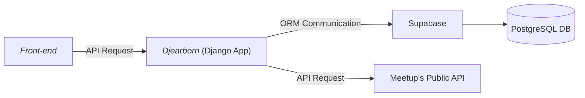

# 🐍 Djearborn - Dearborn Coding Club's Backend Django Server
🐍 A Django backend API webserver for serving static assets and handling requests for dearborncodingclub.com. It is currently hooked up to https://api.dearborncodingclub.com/notes. Please ask to join our slack channel [here](https://dearborncodingclub.slack.com)! We'd also love to have you hang out in our meetup group [here](https://www.meetup.com/dearborn-coding-club).

## Table of Contents
1. [Architecture](#architecture)
2. [Getting Started](#getting-started)
    * [Running with Virtual Env](#running-with-virtual-env-recommended)
    * [Running with Docker](#running-in-docker)
3. [Deploying to Fly.io](#deploying-to-flyio)
4. [Regenerating Certs](#regenerating-tls-certificates)
5. [Running on a different domain](#running-the-application-on-a-different-domain)

### Architecture
---

**System Design**


**Folder Structure**

```
website-base-backend/
|--- Dockerfile         # Docker configuration
|--- Makefile           # Helper file to run scripts
|--- manage.py          # Used to run Django server
|--- core/              # Core Django app features
    |--- migrations/
    |--- templatetags/
    |--- admin.py
    |--- apps.py
    |--- models.py
    |--- serializers.py
    |--- tests.py
    |--- views.py
|--- public_api         # `api.dearborncodingclub` features
    |--- asgi.py
    |--- settings.py
    |--- urls.py
    |--- views.py
    |--- wsgi.py
|--- server             # Database config
```

### Getting Started
--- 
### Running with Virtual Env (recommended)
1. Make sure you install `python3` on your local machine and  have a virtual environment set up.
    - Run python environment
        - `python -m venv ./` or `python3 -m venv ./` if you have `Python3`.
    - Activate local python env.
        - `source bin/activate`.
    - Upgrade pip
        - `python -m pip install --upgrade pip` or `python3 -m pip install --upgrade pip` if you have `Python3`.
    - Install python dependencies
        - `python -m pip install -r requirements.txt` or `python3 -m pip install -r requirements.txt` if you have `Python3`.
    
    - If you don't have the `python3` alias set, you can configure the from alias for `python3` to point to your `python` installation.
        - `echo 'alias python="python3"' >> ~/.zshrc && source ~/.zshrc;`
2. Run the application.
    - Run `make run` or
    - Run `python manage.py runserver`.

### Running in Docker
---
- Ensure you have docker [desktop installed locally](https://www.docker.com/products/docker-desktop/).
- Run `docker login`.
- Run `docker run -p 8000:8000 --rm -it $(docker build -q .)`.
    - Optionally, you can run `make run`.

- Go to http://localhost:8000 in your web browser and view backend endpoint locally.

### Deploying to Fly.io
---
We currently use [Fly.io](https://fly.io) run the service.

We deploy the app via GitHub Actions whenever a PR merges into main (points to https://api.dearborncodingclub.com).
 
You can also deploy the application manually by executing `flyctl deploy` from the repo folder, after logging in to an admin account locally (`flyctl auth login`).
- You can install the `flyctl` CLI tool too.

### (Re)generating TLS Certificates
---
[Fly.io](https://fly.io) handles our TLS certificates as part of their managed hosting service. We have manually generated a Let's Encrypt certificate using:

`fly certs add dearborncodingclub.com`

### Running the application on a different domain
---
- If you want to run the application on a different domain, be sure to add to the `settings.py` file under `ALLOWED_HOSTS`.